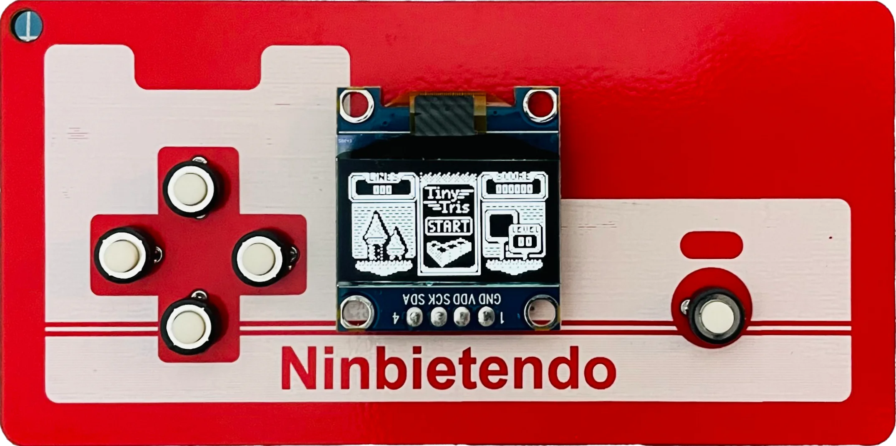
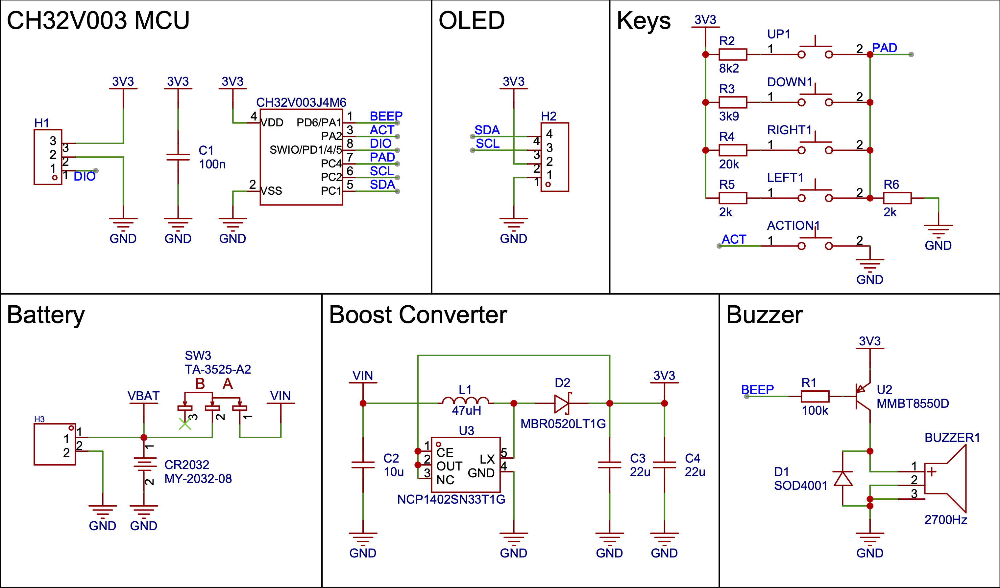
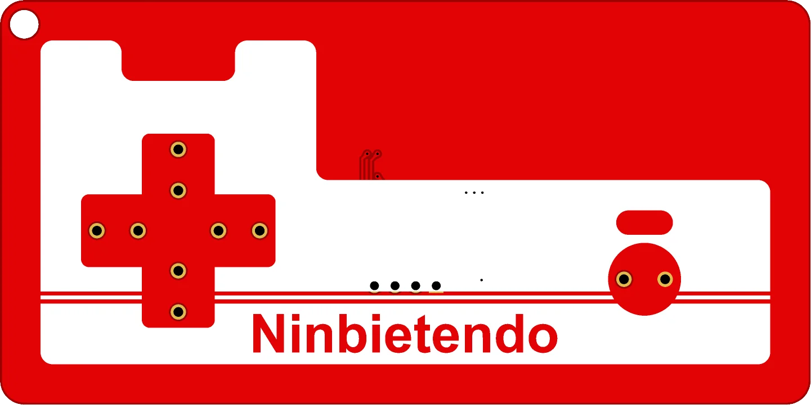
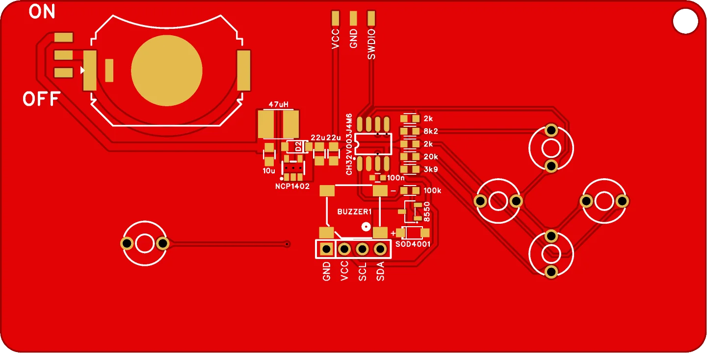

# CH32V003 Game Console PCB

A Redesigned PCB for [Stefan Wagner's Game Console](https://github.com/wagiminator/CH32V003-GameConsole) Project.

Video: [BiliBili - What Games Can Run on a 10-Cent MCU?](https://www.bilibili.com/video/BV1714y117sJ/)

- Add a NCP1402 boost converter, the game console can be powered by a single cell AA battery.
- Save battery by increasing R1 to reduce the current on buzzer.

## Schematic

## PCB

